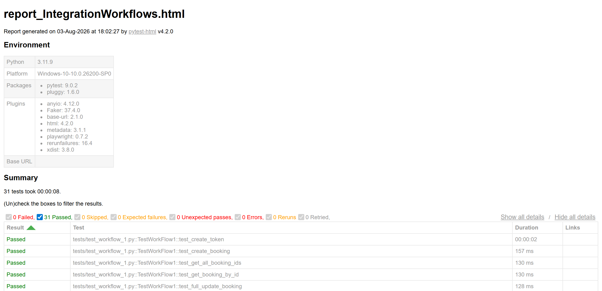

# RESTful Booker API Test Automation - Python + requests

[](https://github.com/teranastasi9-source/restful_booker_automation/actions/workflows/tests.yml)


Purpose: Python-based test automation framework for https://restful-booker.herokuapp.com. Portfolio demonstration of API automation and pytest best practices.

## Project Overview
|Aspect| Details                                    |
|------|--------------------------------------------|
|**API Under Test**| RESTful Booker (Public demo REST API)      |
|**Tool**| Pytest + requests + responses              |
|**Auth**| Token (Cookie)                             |
|**Test Types**| Integration Workflows + Negative-path + Mocked Response + Multi-booking creation |

## API Documentation
The API's own docs - [restful-booker.herokuapp.com/apidoc](https://restful-booker.herokuapp.com/apidoc/index.html)
(generated with [apiDoc](https://apidocjs.com/), not Swagger/OpenAPI, despite how it's often
described informally) - were the reference used while writing these tests: exact request/response
shapes, required vs. optional fields, and which headers each endpoint accepts.

One concrete example: the docs' own `DeleteBooking` example response is `HTTP/1.1 201 Created`
(filed under a `Success 200` heading, but the actual example is 201, not the 204 REST convention
might suggest for a DELETE) - confirmed against a live request, not just assumed - which is why
`test_delete_booking` asserts `201` rather than the more commonly expected `204`.

## Comparison: Postman vs Python
|Aspect|Postman + Newman|Pytest + requests + responses|
|------|--------------|---------------------|
|**Setup**|Import collection|Install dependencies|
|**Execution**|`newman run`|`pytest`|
|**Mocking**|Postman Mock Server|`responses` library|
|**Reports**|HTML via htmlextra|HTML via pytest-html|
|**Maintainability**|GUI-based|Code-based|
> Note: Postman solution - https://github.com/teranastasi9-source/restful_booker_postman


## This project demonstrates:
  - REST API testing (CRUD operations, authentication, integration workflows, multi-booking creation)
  - Pytest framework (fixtures, HTML report generation)
  - API Client Design (abstraction layer, session management, error handling)
  - Security Testing (token validation, expired/missing/syntactically-invalid tokens, invalid credentials)
  - Negative-path testing (nonexistent resource IDs across GET/PUT/PATCH/DELETE, malformed IDs for GET)
  - Mocking Strategy (isolation for impractical scenarios)
  - Documentation and reproducibility practices


## Project structure
```
restful_booker_automation/
  .github/workflows/tests.yml          - CI: lint + tests on push/PR, weekly schedule, manual
  .claude/skills/                        - project-scoped Claude Code skills (see below)
  CLAUDE.md                                - code-review checklist read by Claude Code
  Dockerfile                                 - optional containerized test run (see "Run tests in Docker")
  .dockerignore                                - keeps .git/caches/.env out of the Docker build context
  .pre-commit-config.yaml                        - runs ruff automatically before each commit (see "Linting")
  docs/report_screenshot.png                 - report screenshot embedded below, for a no-clone preview
  pyproject.toml                               - ruff config
  requirements-dev.txt                           - + ruff and pre-commit, for linting
  libs/
    api_client.py                                    - API client wrapper for RESTful Booker
    api_validate.py                                  - validation methods for RESTful Booker
  reports/
    report_IntegrationWorkflows.html                   - generated HTML report
    test_logs.log                                      - generated text log
  tests/
    conftest.py                                          - fixtures (api_client, health_check, api_validate)
    test_workflow_1.py                                     - Workflow 1: Full CRUD Lifecycle
    test_workflow_2.py                                     - Workflow 2: Authentication Token Lifecycle
    test_workflow_3.py                                     - Workflow 3: Multiple booking creation
    test_negative_scenarios.py                             - Negative-path checks not covered by the workflows above
  .env                                              - environment variables (not committed)
  env.example                                         - template for .env, safe to commit (public demo creds)
  pytest.ini                                          - pytest configuration
  requirements.txt                                      - Python dependencies
```


## Integration Workflows -> tests/
### Workflow 1: Full CRUD Lifecycle -> test_workflow_1.py
    [Given valid authentication credentials
    When I request an authentication token
    Then I receive a valid token

    When I create a new booking (no auth required)
    Then the booking is created with unique ID

    When I retrieve all booking IDs
    Then the new booking appears in the list

    When I retrieve the booking by ID
    Then all booking details match creation data

    When I fully update the booking (PUT with token)
    Then lastname and checkout are updated
    And all other fields are preserved

    When I retrieve the booking by ID
    Then the update is reflected correctly

    When I partially update the booking (PATCH with token)
    Then only firstname is updated
    And all other fields remain unchanged

    When I retrieve the booking by ID
    Then the partial update is reflected correctly
    
    When I delete the booking (DELETE with token)
    Then the deletion is successful
    
    When I attempt to retrieve the deleted booking
    Then I receive 404 Not Found

    When I retrieve all booking IDs again
    Then the deleted booking no longer appears]

### Workflow 2: Authentication Token Lifecycle -> test_workflow_2.py
    [Given valid authentication credentials
    When I request an authentication token
    Then I receive a valid token

    When I create a new booking (no auth required)
    Then the booking is created with unique ID

    When I retrieve the booking by ID
    Then all booking details match creation data

    When I fully update the booking (PUT with token)
    Then lastname and checkout are updated
    And all other fields are preserved

    When I retrieve the booking by ID
    Then the update is reflected correctly

    When I attempt to update the booking with an expired token (mocked)
    Then I receive 403 Forbidden

    When I retrieve the booking by ID
    Then all booking details remain unchanged
    
    When I attempt to update the booking without the Cookie header
    Then I receive 403 Forbidden

    When I retrieve the booking by ID
    Then all booking details remain unchanged

    When I partially update the booking (PATCH with token)
    Then only firstname is updated
    And all other fields remain unchanged

    When I retrieve the booking by ID
    Then the partial update is reflected correctly

    When I delete the booking (DELETE with token)
    Then the deletion is successful

    When I attempt to retrieve the deleted booking
    Then I receive 404 Not Found]

### Workflow 3: Multiple booking creation -> test_workflow_3.py
    [Given valid authentication credentials
    When I request an authentication token
    Then I receive a valid token

    When I create a new booking (no auth required)
    Then the booking is created with unique ID
    And all booking details match creation data

    When I create a new booking (no auth required)
    Then the booking is created with unique ID
    And all booking details match creation data

    When I create a new booking (no auth required)
    Then the booking is created with unique ID
    And all booking details match creation data

    When I create a new booking (no auth required)
    Then the booking is created with unique ID
    And all booking details match creation data

    When I create a new booking (no auth required)
    Then the booking is created with unique ID
    And all booking details match creation data

    When I retrieve all booking IDs
    Then the new bookings appear in the list
    And each booking_id occurs once

    When I create a booking with a distinctive name and retrieve booking IDs filtered by it
    Then only that booking is returned]


## Negative scenarios -> test_negative_scenarios.py

Independent checks, not chained steps in a workflow - each is self-contained and doesn't
depend on test_workflow_1/2/3 having run first:

- Authenticating with wrong credentials returns 200 with a `"Bad credentials"` reason, not a
  token (the API's own behavior, verified directly - not 401/403)
- GET on a booking ID that doesn't exist, and on a non-numeric booking ID, both return 404
- PUT/PATCH/DELETE on a booking ID that doesn't exist all return 405, not a silently-created
  or silently-successful response
- PUT with a syntactically-invalid token (never issued by the API at all, not just expired or
  missing) is rejected with 403, same as the missing/expired cases in Workflow 2 - creates and
  cleans up its own throwaway booking for this, rather than depending on another test's booking


## Prerequisites
- Python 3.10+ installed (the codebase uses PEP 604 `X | None` union-type syntax throughout,
  which needs 3.10+)


## Test execution
### Rename 'env.example' file to '.env'

### Clone the repository
git clone https://github.com/teranastasi9-source/restful_booker_automation.git

### Install dependencies
pip install -r requirements.txt

### Run specific test
- pytest tests/test_workflow_1.py -v -s
- pytest -m workflow3
- pytest -m negative_scenarios

### Run all tests
pytest tests/ -v -s

## Run tests in Docker

An alternative to the local setup above: the included `Dockerfile` builds a `python:3.11-slim`
image with all dependencies installed, so there's no local Python/pip setup needed at all.

```bash
docker build -t restful-booker-automation .
docker run --rm --env-file .env -v "$(pwd)/reports:/app/reports" restful-booker-automation
```

`--env-file .env` supplies `BASE_URL`/`USER`/`PASSWORD`/etc. at runtime rather than baking them
into the image (`.env` is excluded via `.dockerignore`) - still just the public demo credentials
here, but the right habit regardless. The `-v` mount writes the HTML report and log back out to
`reports/` on the host. Pass extra pytest arguments after the image name, e.g.
`docker run --rm --env-file .env -v "$(pwd)/reports:/app/reports" restful-booker-automation pytest -m workflow3 -v -s`.

On Windows Git Bash specifically, prefix the command with `MSYS_NO_PATHCONV=1` (e.g.
`MSYS_NO_PATHCONV=1 docker run --rm --env-file .env -v "$(pwd)/reports:/app/reports" ...`) -
without it, Git Bash's automatic path translation silently mangles the `$(pwd)` mount so the
container runs fine but the report never actually reaches the host. PowerShell/cmd and
macOS/Linux shells aren't affected.

This is a local/manual convenience, not part of CI - the GitHub Actions workflow already runs on
a consistent `ubuntu-latest` runner, so containerizing it wouldn't add anything there.

## Expected output
After running, you should see:
  - All tests executed successfully
  - HTML report generated in reports/report_IntegrationWorkflows.html
  - test log generated in reports/test_logs.log

Report includes:
  - Pass/fail status per test step
  - Test step duration
  - Summary dashboard

**Live report:** redeployed to GitHub Pages after every push to `main` - see it at
[teranastasi9-source.github.io/restful_booker_automation](https://teranastasi9-source.github.io/restful_booker_automation/)
without cloning anything.

A recent run's report is also committed at `reports/report_IntegrationWorkflows.html` so you can
see the results without running anything - open it directly in a browser.




## Linting

Code style is checked with [ruff](https://docs.astral.sh/ruff/) (config in `pyproject.toml`).

```bash
pip install -r requirements-dev.txt
ruff check .          # report issues
ruff check . --fix    # auto-fix what can be auto-fixed (import sorting, unused imports, ...)
```

A `.pre-commit-config.yaml` is included so the same check can run automatically before every
commit, instead of relying on remembering to run it (or waiting for CI to catch it):

```bash
pip install -r requirements-dev.txt
pre-commit install    # one-time, per clone - wires the git hook
```

From then on, `git commit` runs `ruff check` on the staged files first and blocks the commit if
it fails - the same rule CI enforces, just caught locally before it's pushed.

## CI

Runs on every push/PR, plus a weekly (Monday) scheduled run and manual `workflow_dispatch` (see
`.github/workflows/tests.yml`). If the **scheduled** run fails, a GitHub Issue is opened
automatically (push/PR/manual runs are already being watched live, so they don't) - a "don't
let this go unnoticed" safety net, not a verdict on whether it's a real regression or an
external-API hiccup (see the `triage-api-test-failure` skill).


## Troubleshooting
Issue: ModuleNotFoundError: No module named '...'
  → Run: pip install -r requirements.txt


## Working with Claude Code

This project is read by [Claude Code](https://claude.com/claude-code) via `CLAUDE.md`
(a standing code-review checklist) and four custom project-scoped skills in
`.claude/skills/`:

- **`add-workflow-step`** - the recipe for extending a workflow class or adding a new one:
  where API client methods / validation helpers go, the docstring + Given/When/Then logging
  convention, and - the most important step - verifying real API behavior before writing an
  assertion about it, instead of guessing.
- **`triage-api-test-failure`** - a decision process for telling a real regression apart from
  an external API hiccup (this API runs on a free Heroku dyno, prone to cold-start slowness) or
  a state/ordering bug specific to this repo's intentionally stateful workflow-class design.
- **`create-bug-ticket`** - once a failure is triaged and confirmed real, files it as a GitHub
  Issue: drafts the title/repro steps/expected-vs-actual for review first, then files via
  `gh issue create` - never auto-filed, and never for a failure that turned out to be the known
  Heroku cold-start flake or a state/ordering issue between two steps. CI also opens an issue
  automatically for a failed scheduled nightly run (see "CI" below) - this skill covers the
  other case, when you notice a failure yourself.
- **`write-commit-message`** - house style for commit messages: depth calibrated to the size of
  the change instead of a uniformly long template, with concrete before/after examples.

All four mirror the equivalent skills in `playwright_ui_automation` (the last one identically -
it's about commit-writing habits, not this repo's own API/testing specifics), adapted to this
repo's own conventions rather than copied as-is where it matters - the two projects share a
review philosophy, not identical rules.

**On authorship:** this project's code was written with Claude Code as an assistant, including
the API client abstraction (`libs/api_client.py`, `libs/api_validate.py`) and the workflow-class
test structure. The design decisions - what to test, how to structure the three workflows plus
the negative-scenario coverage added later, what quality bar to hold the code to (this file),
and which of Claude Code's proposals to accept, reject, or send back for another iteration -
were mine throughout.


## Contact
- Anastasiia Zatorska
- Email: teranastasi9@gmail.com
- LinkedIn: http://www.linkedin.com/in/anastasiia9-zatorska
